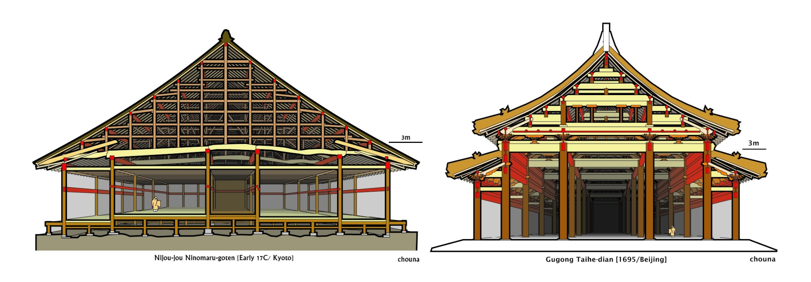
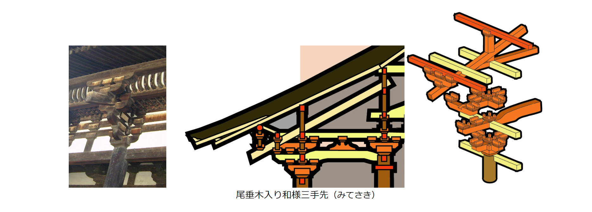

# **日本建筑：一点历史与综述**

By Jacky_Blackson@YoursCraft			Version 0.2.3			Publish On %DATE%

## 零、总序

你好，这是一系列全新的文章，估计内容对你有点陌生。因为他讲述的是与我们隔海相望的国家的建筑和建筑的历史脉络。诚然，日本的建筑与我国古建筑关系颇多，并且外貌和基本结构也是较为相似的，但是，贯穿始终的逻辑和对空间的理解是截然不同的。这边关乎到建筑方方面面从里到外的不同和审美追求的异趣，而也是这一系列小文章想要着重介绍的。

我假设各位读者已经对中国古建筑的历史较为了解，尤其是从南北朝到唐宋的部分，因为这是中日交流的主体时间段，也是对日本古建筑影响最深远的一段时间。因此在这些文章里会有诸多对比，并且会逐步揭示日本建筑如何从这些引进的样式演变而来。

最后，我想先强调几个日本建筑的一般规律，姑且作为开卷的宗义。首先，日本古建筑的发展不是中国式的渐进的，而是伴随着一次次交流高峰呈现跳跃式的发展。其次，每次日本大规模引进大陆式的建筑，都不会进行彻底的学习，而总是选取他们认为最有特色的部分学习，并且总会保留一些自己的固有传统，也就是所谓“国风文化”。最后，日本建筑总带有很强的南源属性，即，日本建筑受大陆南方古建筑影响更强，而对北方建筑的学习更少。

接下来我将按照时间的发展顺序来梳理日本古建筑的脉络，并做一个大体的介绍。

## *a*+*bi*、目录

[TOC]

## *o*(*x*)、导言

一个地方的建筑样式的诞生，离不开诸多因素。有一些是引导性的，另一些是限制性的。而很多限制因素，对日本古建筑风格的形成至关重要。下面，作为入门之言，将一一介绍。

### 1. 日本的自然与社会

日本列岛气候高温多雨，夏季潮湿，但冬季又相对寒冷。这一点与中国大陆，尤其是文明发达的北方地区差异明显。因此岛国的冬夏都没有到让人难以忍受的程度——即便没有特别的防寒措施也能过冬，而夏季需要开敞的建筑空间。这一点和世界其他地方的文明都不甚相同。

另外，正因为自带“岛国”的属性，在日本，无论是山川河流还是平原湖泊都与“大”无缘。各种景观都是小巧但又富于变化的。因此在审美上，日本普遍喜欢小巧精致之美，而不是雄伟壮阔之美。然而这里还有另一层原因：在列岛之国土上，各种资源是极其有限的。就算从文明的发展来看，日本的文明都是落后的，不论是器皿的制造、社会制度、建筑工艺上，都比旁边隔海相望的大陆晚一个甚至好几个时期。文明只能在山间海边的小平原上缓慢发展，导致不论是公卿贵族，还是平民布衣，其财富差异都不甚明显（相较于同时期的大陆文明）。因此，不论是统治者还是平民，其生活总是不太富裕。甚至到了江户时期还不能得到较好的缓解。

但也因此，受周遭汪洋大海的保护，日本并未受到过侵略，也从未被其他国家在政治或军事上统治过。因此总是在“保持一定距离的基础上对其他国家的文化加以吸收、利用”（太田博太郎《日本建筑史序说》，1947）而且因为这种封闭的小环境，日本自从早期人类从大陆移民而来后，并没有经历过大范围的移民和民族重组。因此对于自古以来的各种制度，也有很多继承，这里也包括建筑方面。 

### 2. 日本人的建筑观

在中国或者西欧，建筑观在历史上一直是以大为美——建筑总包含着人与自然的对抗之意，例如宫殿或者教堂，都是巨大而宽敞的。然而这点在日本不成立。从早期的皇家建筑——以神社本殿为代表的三开间二进深的小殿，对比中国讲求九五至尊的大殿，到动辄百米高的教堂，这在建筑本身审美上就存在巨大的差异。诚然，在日本也有诸如出云大社或者是东大寺的早期巨构，但这毕竟不是主流。日本的建筑不强调建筑自我存在的气势，而更加注重建筑对自然的和谐和谦逊。

这方面的差异是显著而本质的，因此不妨举一些例子来支撑。以平安时代公卿贵族对建筑的评价为例，能看出这种差异的确审美的区别，而不是限于物质材料的妥协。藤原赖通建造的平等凤凰堂有“极乐如有疑，请看宇治寺”之赞誉。说明当时世人普遍欣赏藤原赖通花费巨资打造的凤凰堂，并且认为它就是平安时代人们心目中极乐净土的人间投影。然而凤凰堂也不过是正殿方三间、左右宽度甚至不足百米的小建筑。因此我们可以说，在有限的小宇宙内，追求无限的洗练之美才是当时建筑创作的目标。再来看藤原道长对另一些建筑的评价。藤原道长倾心赞美法成寺无量寿院的洗练之美，但是对于东大寺，却直言不讳道“东大寺只是佛大”；评价堀河殿庭院之美是“美到不可言传”，有时会用“尽善尽美”来赞成，却从来不提建筑物如何气势宏大，或者体量雄伟的赞誉之词。（太田博太郎《日本建筑史序说》，1947）

另外在对建筑空间的理解上，中日建筑有很明确的分歧。中国的古建筑，一般存在严格的室内室外之分——亭榭建筑自然不会加上门窗，而殿阁的门窗是随着建筑落成变安装好的。但是在日本，除了佛寺之外，很难见到固定不变的装修。从平安时代的各式屏风和支摘窗（蔀户）到后来的推拉门（障子），这些装修都是可拆卸的。也就是说室内空间是按照使用随时变更的。这也体现在仪轨上面。平安时期在贵族的“寝殿造”宅子里面发生的重大礼仪和排场都是以主屋的室内和户外的庭院联合成一体来举行的。这样，日本的建筑，尤其是住宅建筑，基本没有不可移动的墙壁或者隔断，而是可以根据功能自由调整，整体上追求纤细、通透、轻盈。

在对建筑立面效果的追求中，中日也有巨大的不同。中国古建筑在建造过程中一般追求的是里面整体的高耸和端庄，追求的是纵向的高度和体量。然而在日本，建筑更加看中的是水平线条的肌理。一个典型的日本建筑从下到上总是被诸多线条划分成一段段很短的叠层：最下面浅浅的台基、上面的缘侧、缘侧上面的钩栏、钩栏上面的柱网以及突出的横向的长押组、以及再向上的铺作、檐口以及十分突出的正脊。中国古建筑在正脊的末端还要加上冲天的鸱尾来收束，而日本建筑更钟爱水平的鬼瓦加沟头。就连后期追求高耸的天守阁也绝对不会容忍瘦长的立面产生，而是要用多层的腰檐、格式的破风和平座来把立面分割，尽量打破这种高耸的感受，化解成水平的微曲线条。这种对水平线条的强调让日本建筑总是体现为一种舒展的状态，而普遍就使用空间而言，比较低矮。

除此之外，日本建筑对整体视觉美学的倾向也和中国古建筑不同。中国古建筑往往追求立体的美感，不论是从正立面、侧方、背面，还是远近高低来看，始终要保持一致的端庄美感，也要保持一致的空间体验。因此我们采用了反翘的屋面、各种檐下、山面的装饰，以及对垂脊的推山来进行优化。然而日本古建筑往往只追求某一个立面的美感。即，中国古建筑强调“雕塑美”，而日本古建筑强调“绘画美”。（太田博太郎《日本建筑史序说》，1947）最典型的例子还是宇治凤凰堂。这栋巅峰之作的欣赏角度只有从正面，然而从侧面乃至后面看，都很难说有美感。

> 宇治凤凰堂的正面

> 宇治凤凰堂的侧面

这也导致了另一个问题，就是日本建筑普遍的进深不足（不讨论禅宗建筑传入后流行起来的方形地盘布置）。这也和日本的原生建筑形式有关。截止至以法隆寺为代表的飞鸟样建筑的初传入，日本本土的建筑不论开间大小（大至7间都有发现），这些建筑的进深普遍只有两间。

因此在后来的建筑中，建筑至大，也不过进深四间，四架椽（具体原因见下)。因此，日本建筑总是追求单一的角度之美，这一点在后来的各种园林、城郭以及其他的建筑中总有体现。天守阁总是追求单一立面的美观，而园林也普遍只能静观，而不能像中式的园林一样在其中穿梭游览，一步一景。

综上所述，日本古建筑在对建筑结构的理解与中国古建筑是截然不同的。这一点也是导致两地建筑不同的一个根本原因。在日本的古代，建筑普遍是进深2间，两架的简单建筑。即使是天皇所居住的皇宫，也只是各种尺寸放大了而已，也不会出现更多进深的建筑。这方面的例子可以看伊势神宫的本殿，现在普遍认为这代表了佛教建筑从半岛传入前日本建筑的样貌。事实上在半岛建筑传入前，日本建筑已经在此基础上有所发展——处于礼仪和功能的需要，日本人开始在建筑的前面、侧面乃至后面增加挡雨的披檐。这种披檐他们称之为“庇”（见下图）。

当披檐遍布建筑的四周时，人们又在转角的部分加上了披檐，至此，日本早期类似“歇山顶”的屋顶样式诞生了。但是这里同中国式的歇山顶有本质性的区别：在日本，歇山顶中央类似悬山的部分（那个两间的空间）总是被称为“主屋”，或者“身舍”（如下图），

而周围类似庑殿顶下段的部分被称为“庇间”或者“外阵”。这种称呼上的分类不仅是一种叫法，更是功能上的区分。主屋是真正起居发生的地方，而庇间则是各种礼仪发生的地方，也经常是和户外一起使用的类似阳台的地方。

事实上，这里发生的这种对空间的理解也是后来日本住宅建筑发展的基本逻辑（至于为什么说住宅建筑，请看下一小节）。也即，因为使用的需求，而不断在原先房舍的周遭加盖新的房间，并令他们被一个屋顶所覆盖。依照这个逻辑，寝殿造逐渐发展，并最终产生了主殿造、书院造。

### 3. 本土-外来，坚守-变革，多样-统一

恐怕各位读者都有所了解，日本的建筑总是学习、模仿中国建筑。但是，这种模仿有很多特点。例如：日本总是从中国大陆引入一些建筑样式，但是却会在很短的时间内标准化，并且之后便一段时间内不再关注中国建筑的新发展。又例如，日本似乎更加关注建筑本身的外观类似中国，而不怎么关心结构上的问题。再例如，日本虽然引入中国式的建筑，但是却不怎么引入中国式的使用方式。这些问题就是这节的主要内容。

似乎大家总认为，中国大陆建筑样式的传入是从圣德太子开始的。但是这其实不确。在日本三重县古坟发现的陶屋上发现有大斗的痕迹，说明早在飞鸟奈良时代之前，日本早已通过某些途径和大陆建筑有所交流。但至于交流的程度，这里是未知的。我们只知道，仁德天皇（290-399，16代）的难波高津宫建有高台，传说雄略天皇时代开始建造楼阁。但至于是后代文献放的卫星还是本来如此，难以论说。但是综合目前的考古和现在神社的样貌，我更倾向于，这一时代的日本建筑还停留在古早的3开间2进深的早期建筑，即使有部分大陆技术，也仅仅停留在细节部分。

真正的大规模引入大陆建筑和文化还要等到佛教的传入和圣德太子。随着佛教的传入，一起带来的还有相关的佛寺、佛像技术。最早的可以追溯到法隆寺所代表的“飞鸟样式”。这种样式形式高古，结构上也比较古早。虽然明确可以知道是从朝鲜半岛的百济引入的，但大抵可以看到当时大陆建筑的影响。然而从这时开始，日本的建筑就分裂了。一方面，国家上层都笃信佛教，而处于各种需要也开始不断引入和崇尚中国的文化；但另一方面，在上层人士中间，也在坚守着日本之前的素木简朴的建筑审美。这导致，两种完全不同的审美倾向同时交织在一群人身上，最终导致了建筑形式和建筑用途的深层次绑定。

何谓深层次绑定？也即，某种建筑形式往往只能是某个功能的建筑。例如在日本晚期，禅宗寺庙必须用禅宗样，和样只能用于神社或者净土宗，一般住宅用书院造，茶室用数寄屋造。这就导致，日本虽然建筑样式看上去非常多、眼花缭乱，但是每种样式中间却缺乏演变，同种样式的不同建筑互相之间差异很小。这也和日本建筑界的另一个习惯有关：那就是竞相对某个“范例”的模仿。一旦某种样式传入日本，并获得了广泛的认可，日本的匠人们就会拥立某一个建筑为这种样式的范本，并在新建造的建筑中可以从头到脚的模仿这个老建筑，甚至会去借阅老建筑当年的图纸或者是自己去测绘老建筑。这在中国很难发生，就好像明清的人们复建西安大雁塔院落不会去全国上下寻找当年唐代建筑并仿制一个；然而，日本在室町时期复建的兴福寺金堂却号称根据唐招提寺金堂完全仿制（虽然细节完全不一样）。这导致同种建筑样式的建筑的差异非常小，并且经常缺乏变化。

然而这种变化上的欠缺不太适用于一般人居住的住宅建筑。这大概是因为住宅建筑往往热爱采用日本本土的建筑样式，而非大陆的舶来品。事实上，住宅建筑一直在发展和变化着。从最早的仓房样式的住宅，再到后来完成的歇山顶住宅，再到之后的寝殿造、主殿造、武家造、书院造……这些虽然被人为的分成了不同的样式，但是其实具有清晰的继承关系，其建造技术和设计意匠没有发生根本的改变。这大概是因为住宅建筑并没有佛教建筑崇古的思想特性，也没有舶来技术导致的发展缺失。因此住宅建筑是日本建筑史中最灵活多变的建筑类型。

总而言之，在看待日本建筑的时候，我们应该保持明确的功能-样式的观念，并且有意区分各种不同的建筑形式。对于发展，我们一要注意每个建筑样式随着时代的缓慢变化，但是我们也要注意不同建筑样式对彼此的吸收和转化。毕竟每次这种吸收和转化发生的时候，一般都是日本社会结构突变的时间段。

下面我们就开始这本书的正文吧！

## 一、古坟

### 1. 何谓古坟

古坟。如其字面意思，就是远古建造的坟墓。而在这里，这两个汉字代表着一个酷爱建造这种坟墓的时代——弥生时代。我们对这个时代知之甚少，不论是建筑、人种、社会还是外交。但是可以肯定的是，这个时代是日本一切本土建筑样式的发端和根源。

古坟本身就是一种建筑，也是一些纪念碑。他们有众多的形式：圆形的、方形的、放射状的……但其中数量最多的还是一种钥匙孔形状的“前方后圆坟”。这些坟墓大小不一、方向不一，但是形制相似。主要都由一些用土和石头堆砌成的缓坡、坡顶的平坦空场和土坡周围的壕沟组成。一般的前方后圆坟，在圆形的部分有墓主人的石砌墓室，而方形的一端是一个平台。

这些古坟的使用细节我们是不清楚的。但是可以肯定，他肯定是一些坟墓，并且是具有权势的部落首领的坟墓。我们还知道，这些古坟顶上不存在建筑的痕迹，也就是说，这些坟墓本身是光秃而空旷的。但是，在古坟上总是分布着一圈圈的陶器（日语中称为“植轮”，也即，插到地里的圆形器物），其中大部分是一些陶制的桶，但也有一些表现了墓主人的生活情况。其中就出现了建筑的模型（类似两汉的明器陶楼的作用）。这些陶楼为我们展示了那个朦胧的时代的吉光片羽，也让我们看到了一切建筑的源头。

古坟究竟从何而来？我们不得而知。但是很明显，这种形式是将日本本土之前的巨石墓室（天照大神自闭的那种石头屋子）同大陆传过来的夯土封土堆的一种结合。而这些植轮和各种形式的陶俑很可能代表着殉葬制度的终结：和中国相似地，日本也从活人地殉葬转变成了陶俑的殉葬。所谓“始作俑者”，纯属是孔子搞错了吧。

这一时期，虽然早期的聚落布局都是杂乱无章的，但是在聚落中总有一些栅栏围起来的空旷场地。它们的作用，我们不得而知，但是这应该是“神社”最原始的形态：一块代表神灵降临的、用栅栏保护起来的场地。早期的这些场地往往靠近山川、河流、海岛或者巨石；然而随着时间的推移，这些场地的位置移动到了聚落之中，并逐渐在上面有了临时的建筑——在重要祭典的时候会搭建起临时的祭祀用的神殿，用以当作神明降临时的居所。这在后来就演变成了神社里面“本殿”的建筑，以及所谓“式年迁宫”的习俗。

虽然时至今日，大多数神社的本殿都是永久性的建筑，并且也都没有了式年迁宫的习惯，但我们仍然可以从锌天皇即位所举行的“大尝祭”中看到一点古老习俗吉光片羽。在这个庆祝秋天收获的节日祭祀中，需要临时搭建起一个和神社建筑很相似的建筑——大尝宫。

古坟时代是一个很长的时代，从我们能看到的绳纹时代开始，一直到圣德太子引进大陆文化结束。我们只是用这种坟墓建筑命名了一个时代，但是这之中，日本的社会形式和统治形式都有了巨大的变化。其中，最重要的是：日本的社会从原始的部落形式，转向了部落联盟，最后大和朝廷（在奈良地区）建立了。另外，在这个漫长的时代日本的建筑有了长足的进展。首先值得注意的就是，贵族的建筑摆脱了原始时期的半地穴建筑的模式，而是进入到了技术更加高超的干栏式建筑模式，并成为日本后来本土建筑模式的滥觞；另外，建筑的规模、结构以及建筑群的布局都有了很大的进展。我们很难说在这段漫长的时期，中国大陆或者是朝鲜半岛和日本有无交流，不过从这时期日本建筑所逐渐拥有的斗、蜀柱、叉手以及搏缝板和微微弯曲的屋顶来看，大陆建筑似乎一直通过某种途径影响着日本，并将这种趋势保持了很久。（虽然很可能是通过百济得到的二手文化）（后话，以后再说）

### 2.源头二脉

不难发现，古坟里面出土的陶土模型可以明显的分为两类：一类是在地面上直接建造的“半地穴式”的房屋；另一些是由柱子高高架起的干栏式建筑。这两种建筑我们认为代表了早期的两种聚落里的重要功能性建筑：半地穴式的建筑是住宅，而干栏式建筑是谷仓，或者保存宝藏的仓库。因此，这两种建筑的直系后代，便是日本后期的住宅建筑和神社建筑。住宅建筑，从半地穴式的房屋，逐渐走到了地面的房屋，但也没有把木地板架得很高；神社建筑从最开始就是高架的干栏建筑。这两种建筑类型，构成了日本建筑的基本款式，并会在之后的发展中逐渐融合，并最终得到日本最特色的建筑样式。

早期的这两种建筑已经找不到实物遗存了，但我们仍然可以从各个时代遗留下来的信息中得到他们的一些特征。在诸多古坟时代的遗址考古中，我们能发现，这之中所有的穴居建筑大概都有一下特征：

1. 覆盖整个生活区域的地穴，并且随着时代发展逐渐变浅
2. 在地穴中栽立的四个柱子，推测上面有井字交圈的梁
3. 在梁的周围架上直达地面的长椽，上面攒尖收顶，就构成了最原始的半地穴建筑

事实上这种建筑在中国早期历史中也存在，并且形式非常类似。这并不是说我国早期同日本人有过深度交流，而是，在原始状态下的有点资源中，自然产生的建筑样式也只能如此了。这一点恐怕在全世界都是如此。随着日本贵族的建筑全面转向高架的干栏式建筑，在高端建筑中，这种地穴形式的建筑自然式微了；然而在平民庶人的住宅中，这种趋势一直在保存着。至迟到镰仓时代，在日本偏僻的乡村中据说仍然可以找到农民使用的如是的半地穴式建筑；另外，直到江户时期，在农民的田舍中仍然会有一部分空间拆掉地板，露出凹陷下去的土地（土の间）来进行生火做饭的工作，这也可以看作是远古半地穴建筑的吉光片羽。

然而，在古老的半地穴式建筑之后兴起的干栏式建筑逐渐成为了日本最高级的建筑类型。这大概和两种因素有关：其一是，远古时期物资匮乏，人们普遍采用高架的建筑作为粮仓，同时也是聚落里最高级和神圣的地方，因此不免成为了后来神社以及皇宫贵族建筑的基本模板；另外就是日本多数地区气候湿热，架高的地板有助于防潮和通风，更利于居住。因此我们可以看到，日本如今作为类似国家“太庙”存在的伊势神宫的本殿建筑，就和在古老的地区出土的粮仓模型如出一辙，而日本后来的很多校仓也和这种形式非常类似；另外在我国南方也普遍存在高高架起的干栏式建筑，来帮助当地人们抵御潮湿和虫豸。

### 3.神社建筑的产生

### 4.早期朦胧的建筑交流

### @建造上手1.1：早期土穴建筑

### @建造上手1.2：早期仓库建筑

## 二、飞鸟

### 1.圣德太子与佛教

### 2.从半岛来的“飞鸟样式”

### 3.稳定都城的确立

### 4.本土建筑的坚守和变革

### @建造上手：飞鸟样建筑——以法隆寺金堂为例

## 三、奈良

### 1.隋唐建筑的初传入

### 2.佛教建筑和伽蓝布局的发展

### 3.住宅建筑的发展

### 4.建筑结构：发展与滞后

### @建造上手：奈良时代的佛殿

### @建造上手：奈良时代的佛塔

## 四、平安

### 1.大陆建筑样式的本土化

### 2.梁柱构架变革与小屋组的产生

### 3.寝殿造的确立

### 4.寝殿造的发展

### 5.神社的变革

### 6.伽蓝布局的演变

### @建造上手：寝殿造宅院

### @建造上手：平安时期的和样建筑

### @建造上手：日式密宗的多宝塔

## 五、镰仓

### 1.重源与大佛样

### 2.禅宗样的传入

### 3.折衷样的产生

### 4.从寝殿造与主殿造看建筑布局的本土化发展

### 5.城堡构造的草创

### 6.里坊制度的崩坏与城下町的兴起

### 7.民居、茶室与数寄屋

### @建造上手：大佛样的东大寺南大门

### @建造上手：禅宗样门楼与小殿

### @建造上手：主殿造武家小院

## 六、战国

### 1.皇室、公家和武家的三种审美

### 2.禅宗样建筑的本土化

### 3.神社建筑的发展

### 4.天守和城堡的发展

### 5.武家书院造的确立

### @建造上手：权现造神社的拜殿和本殿

### @建造上手：简单天守的营造

### @建造上手：简单的书院造

## 七、江户

### 1.禅宗建筑的发展：晚期禅宗样

### 2.小屋组结构的巨变

### 3.西洋桁架技术的引入

### 4.町的确立和市民住宅的兴起

### 5.书院造建筑的发展

### 6.书院造的下放与民居建筑发展

### 7.数寄屋风书院造的成熟

### @建造上手：东本愿寺御影堂

### @建造上手：晚期书院造小殿

### @建造上手：桂离宫风格的庭院（毕业作品）

## 八、推荐文献列表

## 九、后记

